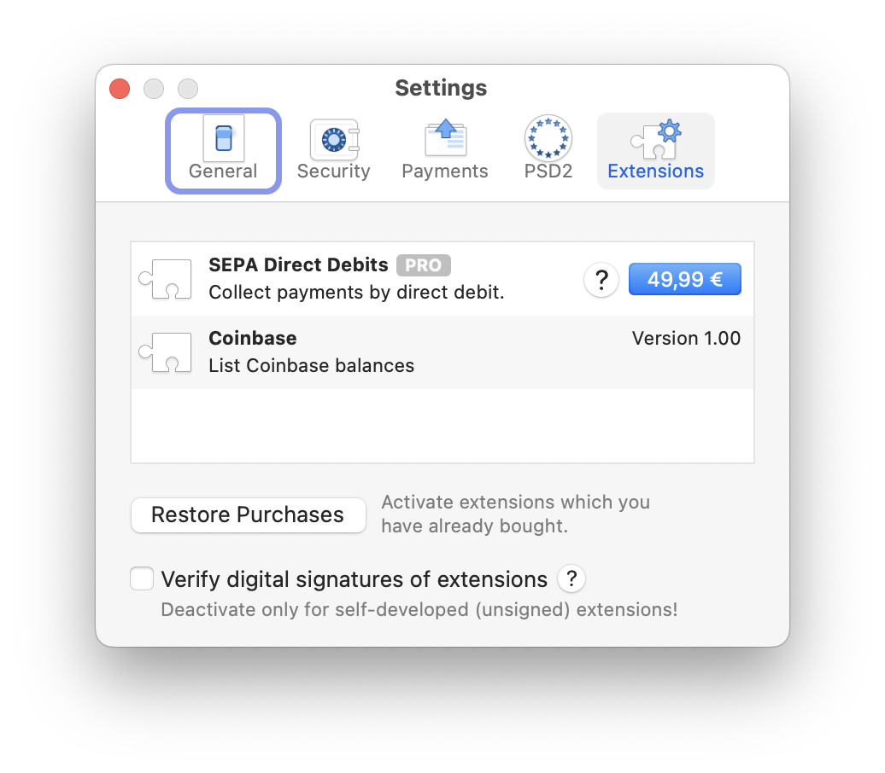

# MoneyMoney Coinbase Extension

This MoneyMoney extension shows your Coinbase wallets and balances using the new [Coinbase Advanced Trade API (v3)](https://www.coinbase.com/en-de/developer-platform/products/advanced-trade-api). The default currency is hard-coded to euro and wallets with a balance lower than €0,01 are currently being ignored.

## Features

I had been happy with [Martin Wilhelmi's extension](https://github.com/mnin/coinbase-moneymoney), but it only supports the now-deprecated Coinbase API v2. While [Felix Nensa's extension](https://github.com/luckfamousa/coinbase-moneymoney) supports the new Coinbase API v3, it didn't really work for me because paging isn't implemented and prices for cryptocurrencies like `CBETH`, `ETH2`, etc. are missing (at least as of December 2024).

This MoneyMoney extension is inspired by both and adds the following features:

- Unlimited number of wallets (by handling paginated API responses)
- Currency conversions which aren't directly available via the Coinbase API

If some currency is not working for you, please open a GitHub issue.

## Installation

Installing MoneyMoney extensions is documented [here](https://moneymoney-app.com/extensions/) (scroll down to **Installation**).

Until this extension is digitally signed by the company making MoneyMoney (MRH applications GmbH), you'll have to deactivate **"Verify digital signatures of extensions"** under **Settings > Extensions**.

 Extensions window">

To use this extension, you have to **create a Coinbase API key** with read-only permissions, which is documented [here](https://help.coinbase.com/exchange/managing-my-account/how-to-create-an-api-key).

Finally, add a new Coinbase account in MoneyMoney with **"+" > Add account > Other > Coinbase** and use your **Coinbase API key name** as your **username** and your **Coinbase private key** as your **password** (copy both values in full).

## Contributing

Contributions are welcome!

## Sponsoring

If you don't have a Coinbase account yet (unlikely if you're looking for this extension, but who knows), feel free to use my [Invite friends link](https://coinbase.com/join/KF96TTX?src=referral-link) to create one.
